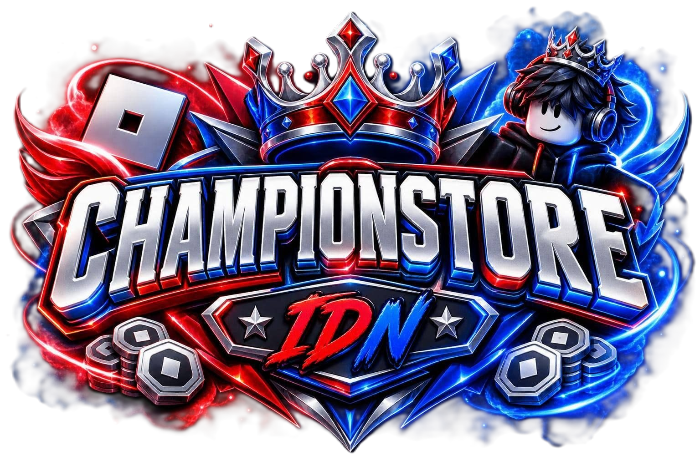

# 🏆 ChampionStore_IDN — Platform Web Top Up Robux Instant & Legal

<div align="center">
  
  
  ### ⚡ Top Up Robux Instant, Cepat, Legal, Aman & Bergaransi 100% Uang Kembali
  
  [](https://nextjs.org/)
  [](https://react.dev/)
  [](https://www.typescriptlang.org/)
  [](https://tailwindcss.com/)
  [](https://supabase.com/)

</div>

---

## 📖 Tentang Proyek

**ChampionStore_IDN** adalah platform web e-commerce modern khusus layanan top up Robux resmi (*legal*) yang dirancang dengan performa tinggi, tampilan bertema *Cyberpunk Red & Blue Gaming*, validasi akun Roblox real-time, integrasi pembayaran QRIS & WhatsApp otomatis, serta **Admin Panel** komprehensif untuk pengelolaan pesanan, stok, harga promo, banner hero, ulasan pelanggan, dan kebijakan retensi penyimpanan otomatis.

---

## ✨ Fitur Unggulan

### 🎮 1. Pengalaman Pelanggan (Customer Frontend)
* **Validasi Akun Roblox Real-Time**: Terintegrasi langsung dengan Roblox Open API untuk mengecek keaslian username, mengambil foto avatar 3D asli, serta mendeteksi Roblox User ID secara otomatis.
* **Dual-Mode Hero Banner**:
  * **Promo Mode**: Menampilkan paket promo spesial dengan harga diskon, countdown timer hitung mundur real-time, dan garansi kilat.
  * **Standard Mode (BloxyLucy Style)**: Menampilkan identitas toko, status layanan buka 24/7, dan 3 pilar keunggulan toko.
* **Pricelist Interaktif**: Pilihan nominal Robux yang dinamis dan terhubung langsung ke database Supabase.
* **Checkout Fleksibel & Cepat**:
  * **Website QRIS**: Tampilan barcode QRIS bersih tanpa jeda (*priority loading*) dengan formulir upload bukti bayar terkompresi.
  * **Direct WhatsApp**: Pembuatan template pesan WhatsApp otomatis berisi detail invoice dan username Roblox.
* **Sistem Ulasan & Testimoni**: Halaman ulasan interaktif (`/review`) dengan token order untuk memberikan rating bintang 1-5 dan upload foto bukti transaksi.

---

### 🛡️ 2. Admin Dashboard & Panel Kontrol (`/admin`)
* **Live Autocomplete Search Bar**:
  * Pencarian instan (debounced 220ms) untuk kode invoice (`CS-...`), username Roblox (`@...`), nomor WhatsApp, serta status pesanan.
  * *Smart Shortcut Navigation* untuk lompat cepat ke menu-menu admin (Pricelist, Pengaturan Toko, Testimoni, Blacklist, dll).
* **Order Management Real-Time**:
  * Monitoring pesanan dengan tab filter: **Order Masuk (Pending)**, **Diproses**, **Selesai**, dan **Dibatalkan**.
  * Dilengkapi fitur salin cepat, pengingat WhatsApp, dan pengiriman link review otomatis ke pelanggan.
* **Pengaturan Toko & Custom Calendar Modal**:
  * Kustomisasi nama toko, nomor CS WhatsApp, upload barcode QRIS, logo navbar, dan foto background banner.
  * **Kalender & Jam Kustom (Tema ChampionStore Red & Blue)** dengan preset cepat (`+3 Hari`, `+7 Hari`, `+14 Hari`, `Akhir Bulan`) untuk mengatur batas waktu promo countdown.
* **Manajemen Pricelist**: Tambah, ubah harga, hapus, dan atur paket promo langsung dari admin.
* **Database Pelanggan & Blacklist**: Rekap data pembeli setia serta fitur blokir username bermasalah / penipu.
* **Moderasi Testimoni**: Persetujuan testimoni pelanggan, balas ulasan (*admin reply*), dan hapus ulasan secara manual.

---

### 📦 3. Optimasi Performa & Retensi Penyimpanan (Storage Lifecycle)
* **Kompresi Otomatis ke WebP (Client-Side Canvas API)**:
  * Semua file gambar yang diupload (bukti transfer, barcode QRIS, logo toko, foto banner, dan ulasan) otomatis dikonversi ke format **`.webp`** dengan reduksi ukuran **70% - 90%**, menghemat kuota Supabase Storage 1GB secara signifikan.
* **Kebijakan Retensi Bukti Transfer 90 Hari**:
  * Foto bukti pembayaran otomatis dihapus dari Supabase Storage setelah berusia **90 hari** agar kapasitas penyimpanan tetap lega.
* **Peringatan 7 Hari Sebelum Penghapusan (Hari ke-83 s/d 90)**:
  * Banner peringatan muncul di dashboard admin saat ada bukti transfer yang mendekati batas 90 hari.
* **Fitur Backup ZIP Sekali Klik**:
  * Admin dapat mengunduh seluruh bukti transfer yang akan kedaluwarsa dalam satu file arsip `.zip` lengkap dengan file ringkasan `DAFTAR_TRANSAKSI_MANIFEST.txt`.
* **Foto Testimoni Bersifat Permanen**:
  * Foto testimoni pelanggan tidak akan pernah terhapus otomatis oleh sistem retensi dan hanya dapat dihapus secara manual oleh admin.

---

## 🛠️ Tech Stack & Library

| Kategori | Teknologi |
| :--- | :--- |
| **Framework** | [Next.js 16 (App Router + Turbopack)](https://nextjs.org/) |
| **UI Library** | [React 19](https://react.dev/) & [TypeScript](https://www.typescriptlang.org/) |
| **Styling** | [Tailwind CSS v4](https://tailwindcss.com/) + Custom Glassmorphism & Cyberpunk Neon |
| **Icons** | [Lucide React](https://lucide.dev/) |
| **Database & Storage** | [Supabase (PostgreSQL)](https://supabase.com/) |
| **Roblox API** | Roblox Users & Thumbnails Public API |
| **Arsip & Kompresi** | [JSZip](https://stuk.github.io/jszip/) & HTML5 Canvas WebP Compression Engine |

---

## 📁 Struktur Direktori Proyek

```text
championstore/
├── app/
│   ├── admin/               # Halaman Admin Panel & Sub-rute
│   │   ├── blacklist/       # Manajemen Blacklist
│   │   ├── customers/       # Database Pelanggan
│   │   ├── orders/          # Manajemen Pesanan
│   │   ├── payments/        # Metode Pembayaran
│   │   ├── pricelist/       # Manajemen Paket & Harga
│   │   ├── settings/        # Pengaturan Toko & Banner
│   │   └── testimonials/    # Moderasi Testimoni
│   ├── api/                 # API Routes (Backend Endpoints)
│   │   ├── admin/           # Auth, Stats, Storage Lifecycle
│   │   ├── blacklist/       # CRUD Blacklist
│   │   ├── customers/       # Data Pelanggan
│   │   ├── orders/          # Pemrosesan Pesanan
│   │   ├── products/        # Endpoint Pricelist
│   │   ├── roblox/          # Validasi Akun Roblox
│   │   ├── store/           # Pengaturan Toko & Banner
│   │   ├── testimonials/    # Endpoint Ulasan
│   │   └── upload/          # Storage Uploader
│   ├── checkout/            # Halaman Checkout Pembayaran QRIS
│   ├── review/              # Halaman Form Ulasan Pelanggan
│   ├── layout.tsx           # Root Layout
│   └── page.tsx             # Halaman Utama (Homepage)
├── components/              # Komponen Reusable
│   ├── admin/               # Komponen Dashboard Admin (Header, Sidebar, Modals, dll)
│   ├── BackgroundEffects.tsx# Efek Glowing & Ambient Cyberpunk
│   ├── CheckoutModal.tsx    # Modal Checkout Cepat
│   ├── FeaturesBar.tsx      # Bar Jaminan & Keunggulan Layanan
│   ├── HeroBanner.tsx       # Banner Hero Promo & Jaminan Toko
│   ├── HomeClient.tsx       # Client Wrapper Halaman Utama
│   ├── Navbar.tsx           # Header Navigasi Pelanggan
│   ├── PricelistSection.tsx # Tabel Pilihan Paket Robux
│   ├── RobloxAccountSection # Input & Validasi Akun Roblox
│   └── TestimonialsSection  # Slider Ulasan & Testimoni Pelanggan
├── data/
│   └── pricelist.ts         # Konfigurasi Default & Daftar Paket
├── lib/
│   ├── compressToWebP.ts    # Utility Kompresi Gambar WebP
│   └── supabase/            # Client & Admin Supabase SDK
├── public/                  # Asset Gambar, Logo, & Favicon
├── supabase/                # File Migrasi SQL & Setup Database
│   ├── schema.sql           # Skema Tabel & Relasi PostgreSQL
│   └── fix_permissions.sql  # Konfigurasi RLS & Storage Permissions
└── package.json             # Dependensi & Script Proyek
```

---

## 🚀 Panduan Memulai (Getting Started)

### 1. Prasyarat Sistem
* [Node.js](https://nodejs.org/) versi 18.18.0 atau lebih baru.
* Akun [Supabase](https://supabase.com/) aktif.

### 2. Clone Repositori
```bash
git clone https://github.com/username/championstore.git
cd championstore
```

### 3. Instalasi Dependensi
```bash
npm install
```

### 4. Konfigurasi Environment Variables (`.env.local`)
Buat file `.env.local` pada direktori root proyek dan isi variabel berikut:

```env
# Supabase Configuration
NEXT_PUBLIC_SUPABASE_URL=https://your-project-id.supabase.co
NEXT_PUBLIC_SUPABASE_ANON_KEY=your-anon-public-key
SUPABASE_SERVICE_ROLE_KEY=your-service-role-secret-key

# Admin Authentication
ADMIN_SECRET_PIN=your_admin_secret_pin
```

### 5. Setup Database Supabase
Jalankan skrip SQL yang tersedia di folder `supabase/schema.sql` dan `supabase/fix_permissions.sql` pada menu **SQL Editor** di Dashboard Supabase Anda untuk membuat tabel:
* `orders`
* `store_settings`
* `products`
* `testimonials`
* `customers`
* `blacklist`
* Storage Bucket: `payment-proofs`

### 6. Menjalankan Server Pengembangan (Dev Server)
```bash
npm run dev
```
Buka [http://localhost:3000](http://localhost:3000) pada browser Anda.

---

## 📦 Build & Deployment

Untuk membuat build produksi yang teroptimasi:

```bash
npm run build
npm run start
```

Proyek ini dapat di-deploy dengan mudah melalui platform [Vercel](https://vercel.com/) atau server VPS berbasis Node.js.

---

## 📄 Lisensi & Hak Cipta

© 2026 **ChampionStore_IDN**. Hak Cipta Dilindungi Undang-Undang.  
Dibuat untuk layanan Top Up Robux terpercaya di Indonesia.
